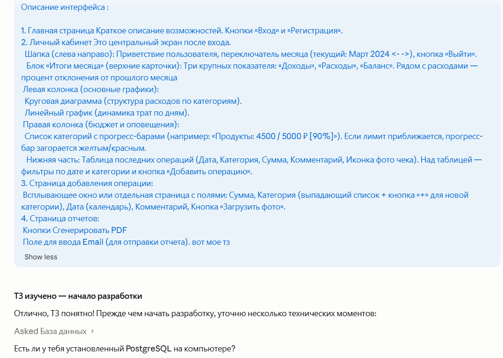
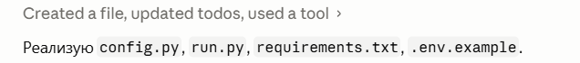
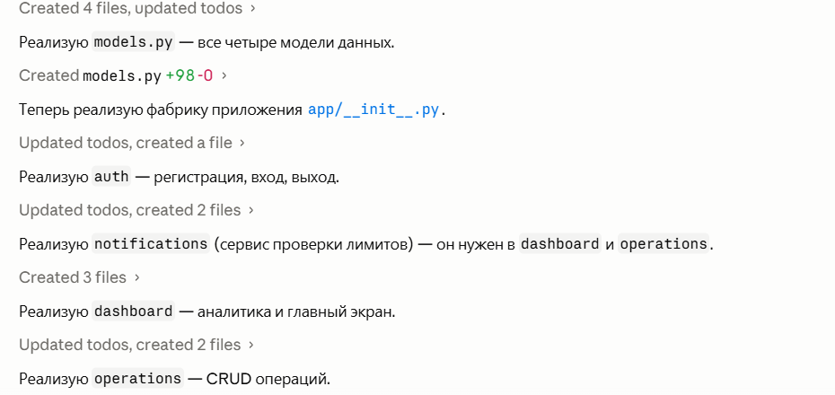
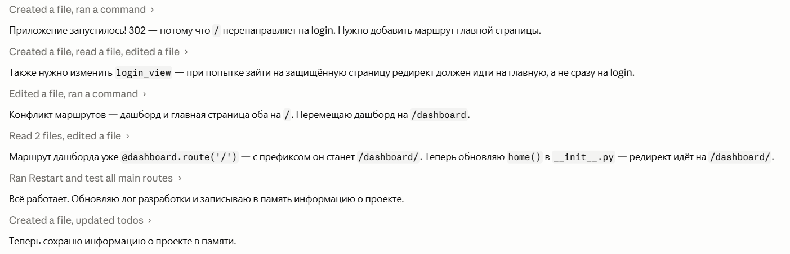
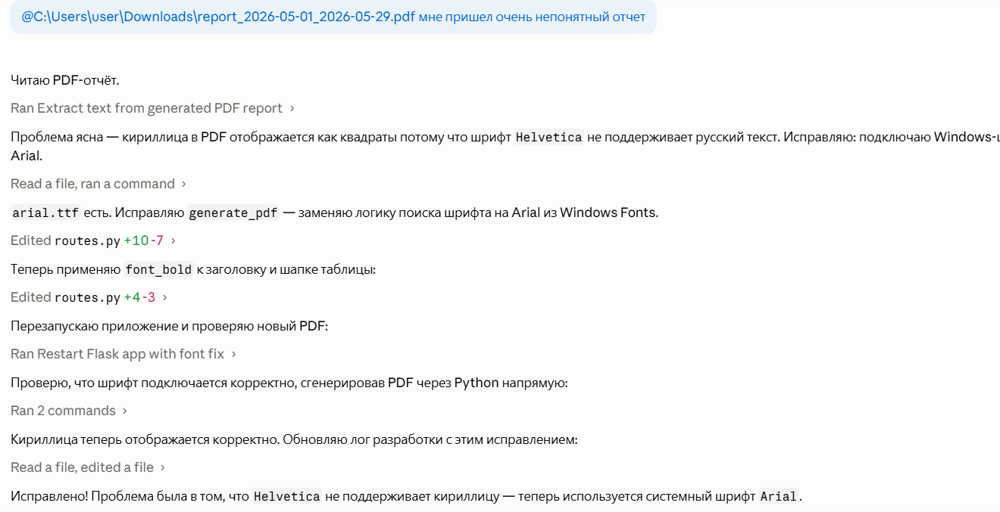
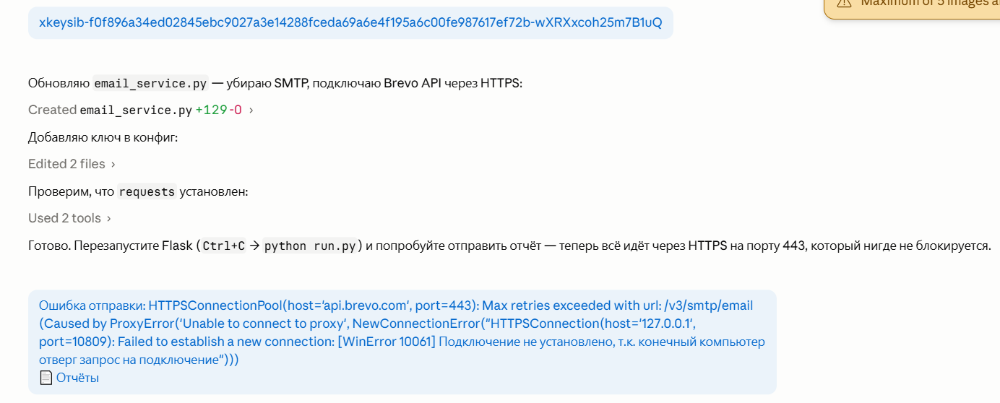
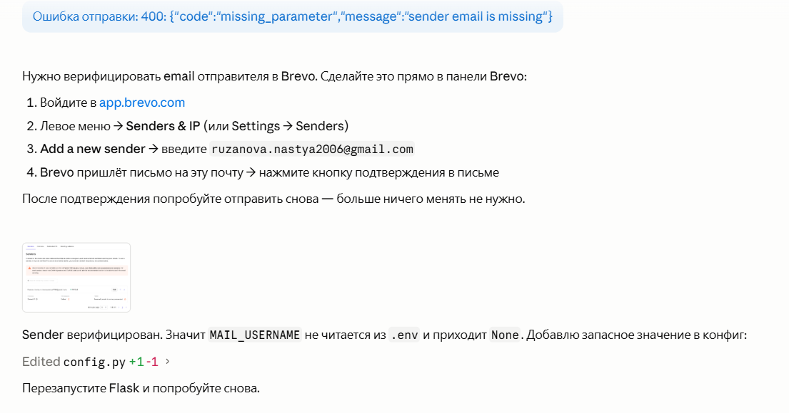
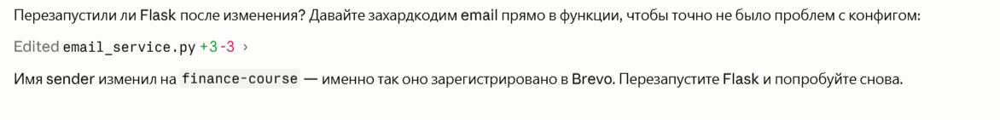

# Листинг процесса разработки веб-приложения «Финансовый дашборд»

Разработка проекта велась в консоли Claude Code для VS Code. В первом промте модели было предоставлено полное техническое задание с запросом предложить структуру проекта и порядок разработки.

- 
- 

---

Проект реализовывался через однотипные промты формата: «Реализуй [название модуля]». Таким образом были созданы все необходимые файлы.

- 
- 
- 
- 

После реализации каждого модуля нейросеть выводила сводку о добавленных функциях и их назначении.

- 

---

При первом тестировании обнаружен баг: главная страница `/` возвращала редирект на форму входа вместо лендинга.

- 
- 

---

При генерации PDF-отчёта весь русский текст отображался как чёрные квадраты (■■■■).

- 
- 
- 

---

По техническому заданию требуется отправка email-отчётов и уведомлений. Был отправлен промт на реализацию отправки писем через Gmail SMTP.

- 
- 

---

При первом тесте отправки письма возникла ошибка — провайдер блокирует SMTP-порты.

- 

Была предпринята попытка переключиться на порт 465 (SSL), однако это тоже не помогло.

- 

Было принято решение отказаться от SMTP и перейти на HTTP API сервиса Brevo, запросы которого идут через порт 443.

- 
- 

---

После перехода на Brevo API возникла новая ошибка — библиотека `requests` подхватила системный прокси VPN-клиента sing-box, который был выключен.

- 
- 

---

При следующем запросе Brevo вернул ошибку об отсутствии email отправителя.

- 
- 

---

После всех исправлений отчёт успешно отправлен на почту.

- 
- 
