# Демонстрация работы веб-приложения «Финансовый дашборд»

В результате выполнения работы разработано полнофункциональное веб-приложение для учёта личных финансов. Ниже представлено описание основных функций и интерфейса приложения.

---

## Главная страница

При переходе на сайт неавторизованный пользователь видит главную страницу с кратким описанием возможностей приложения и кнопками «Зарегистрироваться» и «Войти».

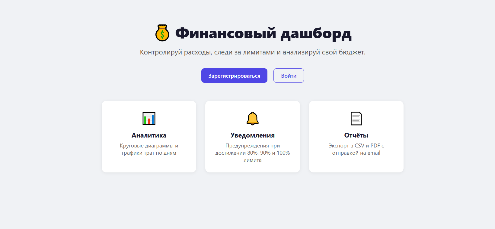

**Возможности приложения:**
- Аналитика — круговые диаграммы и графики трат по дням
- Уведомления — предупреждения при достижении 80%, 90% и 100% лимита
- Отчёты — экспорт в CSV и PDF с отправкой на email

---

## Регистрация

Для начала работы пользователь создаёт аккаунт, указав имя, фамилию, email и пароль.

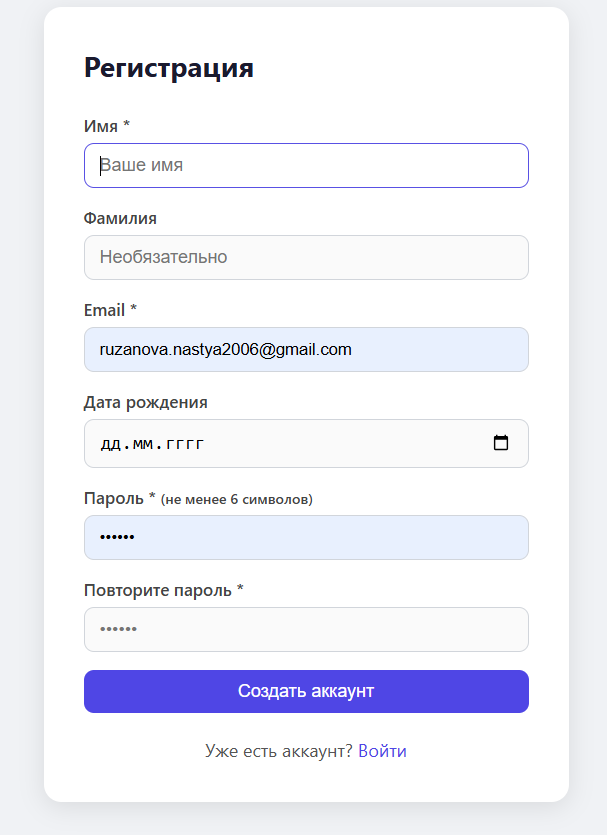

---

## Личный кабинет (Дашборд)

После входа пользователь попадает в личный кабинет. В верхней части отображаются итоговые показатели за выбранный месяц: доходы, расходы и баланс. Доступна навигация по месяцам.

Левая часть экрана содержит круговую диаграмму структуры расходов по категориям. Справа — список категорий с суммами трат.

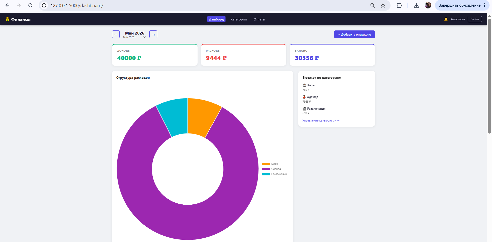

---

## Динамика трат и таблица операций

Нижняя часть дашборда содержит линейный график динамики трат по дням и таблицу всех операций за выбранный период с фильтрами по дате, типу и категории.

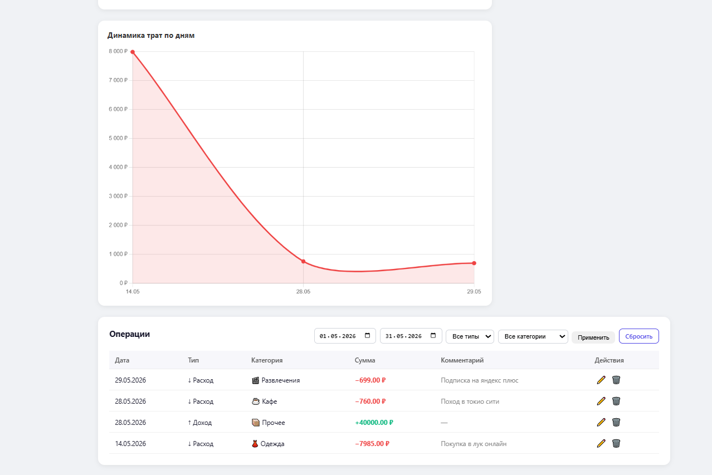

---

## Добавление операции

При нажатии кнопки «+ Добавить операцию» открывается форма с полями: тип (доход/расход), сумма, категория, дата и комментарий.

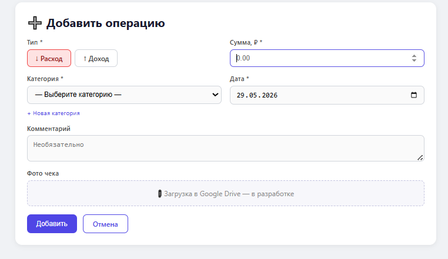

---

## Управление категориями

В разделе «Категории» пользователь видит стандартные и собственные категории. Для каждой категории можно установить месячный лимит расходов — он отображается в виде прогресс-бара на дашборде.

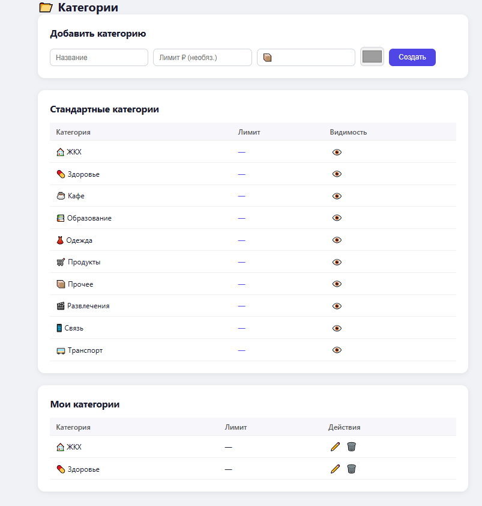

---

## Редактирование категории

Пользователь может редактировать название, иконку, цвет и лимит пользовательской категории.

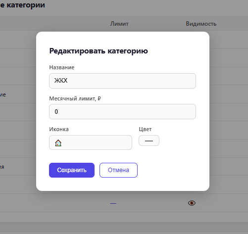

---

## Система уведомлений

При достижении 80%, 90% или 100% месячного лимита по категории в интерфейсе появляется уведомление. Колокольчик в правом верхнем углу показывает количество непрочитанных уведомлений.

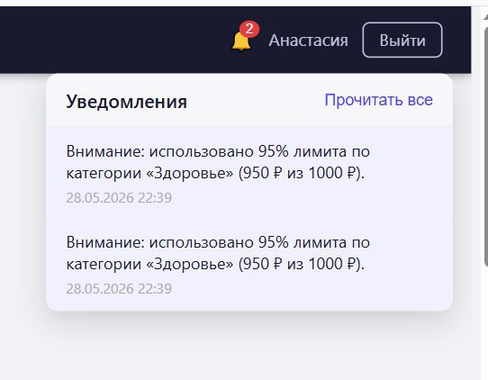

---

## Отчёты

В разделе «Отчёты» доступны три функции: экспорт операций в CSV, генерация PDF-отчёта и отправка отчёта на email. Для каждой функции задаётся период (дата от — дата до).

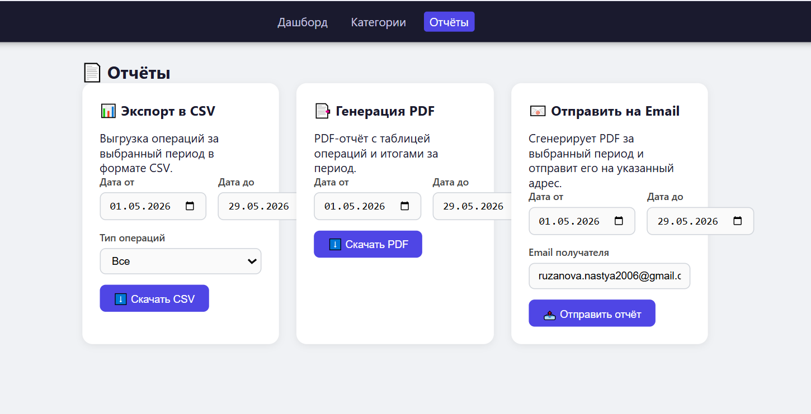

---

## Пример PDF-отчёта

Сгенерированный PDF содержит итоговые суммы доходов, расходов и баланса, а также таблицу всех операций за выбранный период.

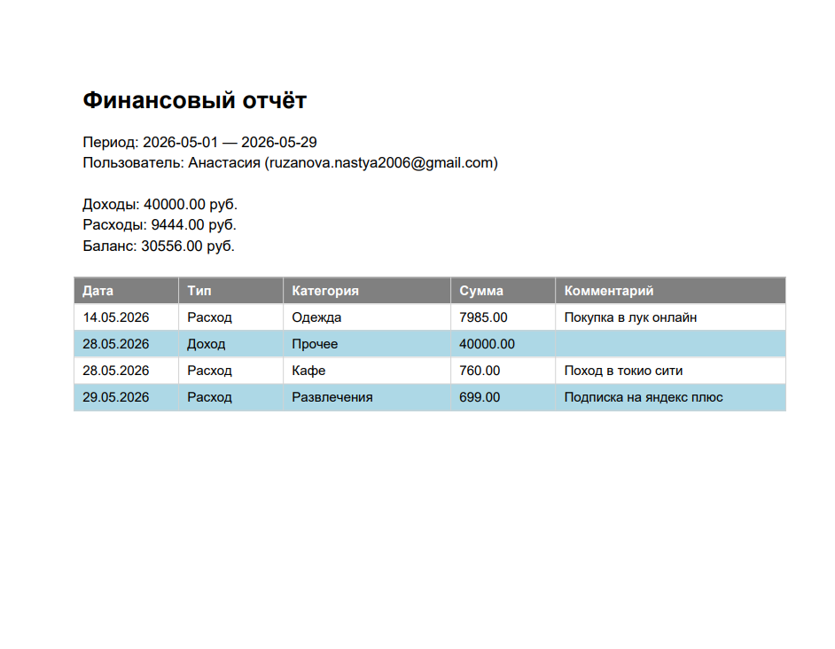

---

## Отправка отчёта на email

После нажатия кнопки «Отправить отчёт» приложение генерирует PDF и отправляет его на указанный адрес через сервис Brevo. Пользователь получает письмо с PDF-файлом во вложении.

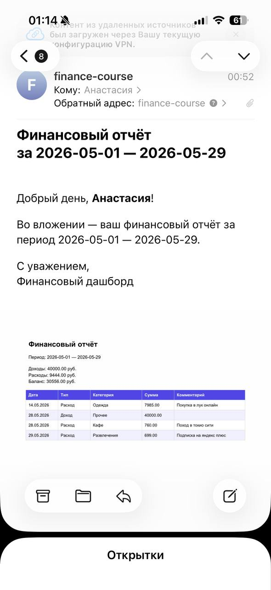
